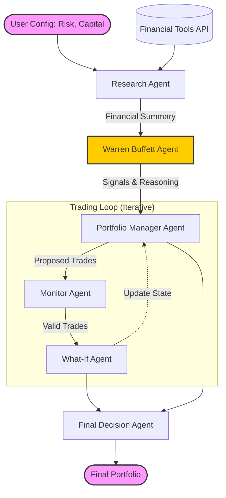

# Autonomous AI-Driven Financial Agent Architecture


An autonomous Multi-Agent System (MAS) designed to automate the lifecycle of value investing. Unlike static algorithmic trading scripts, this system utilizes **LangChain** and **Google Gemini** (LLMs) to perform fundamental analysis, mimic the reasoning of a human investment committee, and optimize portfolios based on Warren Buffett's philosophy.

---

## 🏗️ System Architecture

The system operates on a sequential, loop-based architecture. Information flows from data aggregation to analysis, decision-making, and compliance validation.



## 🚀 Key Features

- Multi-Agent Orchestration: Specialized agents for Research, Analysis, Management, and Compliance working in concert.
- Value Investing Logic: Implements a "Warren Buffett" persona that evaluates Economic Moats, Intrinsic Value (DCF), and Management Quality not just by numbers, but by reasoning.
- Real-Time Data: Fetches standardized financial statements (Income, Balance Sheet, Cash Flow) and metrics via financialdatasets.ai.
- Risk Management: Dynamic capital allocation based on 10 distinct risk profiles (from Ultra Conservative to Highly Speculative).
- Guardrails: A Monitor Agent acts as a compliance officer, ensuring no logical errors (e.g., short selling, negative cash) occur during the simulation.
- Trading Simulator: A "What-If" agent simulates the execution of trades to project portfolio state over multiple iterations.

## 🛠️ Tech StackFramework: 
- LangChain (Python)
- LLM: Google Gemini (gemini-2.5-flash) via langchain-google-genai
- Data Source: Financial Datasets API
- Validation: Pydantic for structured output and type safety
- CLI: Rich library for interactive and beautiful console output

## 📦 InstallationFollow these steps to set up the project locally.
1. Clone the RepositoryBash
 ```bash
   git clone [https://github.com/your-username/ai-financial-agent.git](https://github.com/your-username/ai-financial-agent.git)
   cd ai-financial-agent
   ```
2. Create a Virtual Environment (Recommended)
   ```python
   -m venv venv
   source venv/bin/activate  # On Windows use `venv\Scripts\activate`
    ```
3. Install Dependencies
   ``` bash
   pip install -r requirements.txt
   ```
4. Configure Environment Variables You need API keys for Google Gemini and Financial Datasets. Rename the example environment file and edit it:
   ```bash
   mv env.example .env
   ```
   Open .env and add your keys:
   ```
   GOOGLE_API_KEY=your_gemini_api_key_here
   FINANCIAL_DATASETS_API_KEY=your_financial_datasets_key_here
   ```

## 💻 Usage 
Run the main orchestrator script to start the interactive session:
```bash
  python main.py
```
Interactive Workflow
- Capital: Enter your available capital (e.g., 100000).Portfolio: Input existing holdings (optional) or start fresh.
- Risk Profile: Select a level from 1 (Ultra Conservative) to 10 (Highly Speculative).
- Ticker Selection: Choose to analyze a specific subset (e.g., AAPL, NVDA) or the full defined universe.
- Execution: Watch the agents collaborate in real-time on the console.
- Result: The system outputs a final portfolio allocation table and a detailed report of the decisions.

## 👥 Contributors
- Federico Giorgi
- Luca Barattini
- Blanca Caballero
- Myriam Pardo
